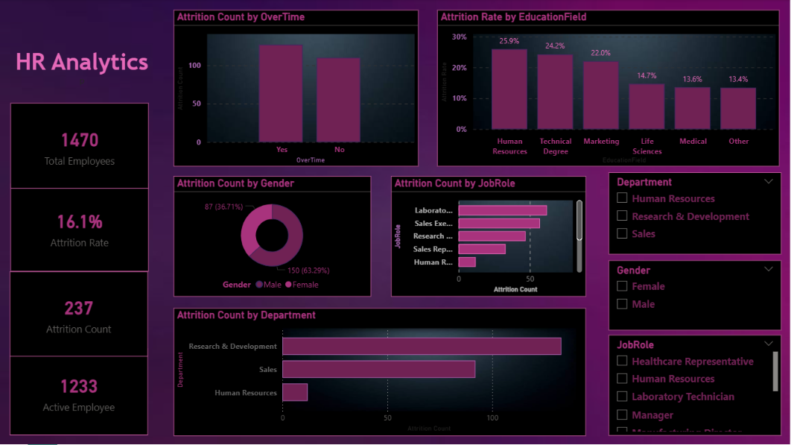

# HR-Analytics-Dashboard
## 📌 Project Overview
This Power BI dashboard provides insights into employee attrition and workforce analytics. It helps HR teams analyze employee turnover using interactive visualizations and KPIs.

## 📊 Dashboard Features
- Total Employees
- Active Employees
- Attrition Count
- Attrition Rate
- Attrition by Department
- Attrition by Job Role
- Attrition by Gender
- Attrition by Education Field
- Attrition by Overtime
- Interactive Slicers

## 🛠️ Tools Used
- Power BI
- DAX
- Power Query
- Microsoft Excel

## 📷 Dashboard Preview

## 📁 Dataset
HR Employee Attrition Dataset

## 📈 Key Insights
- Research & Development has the highest attrition.
- Employees working overtime show higher attrition.
- Attrition varies across education fields and job roles.

## 👩‍💻 Author
Anshika Jain
